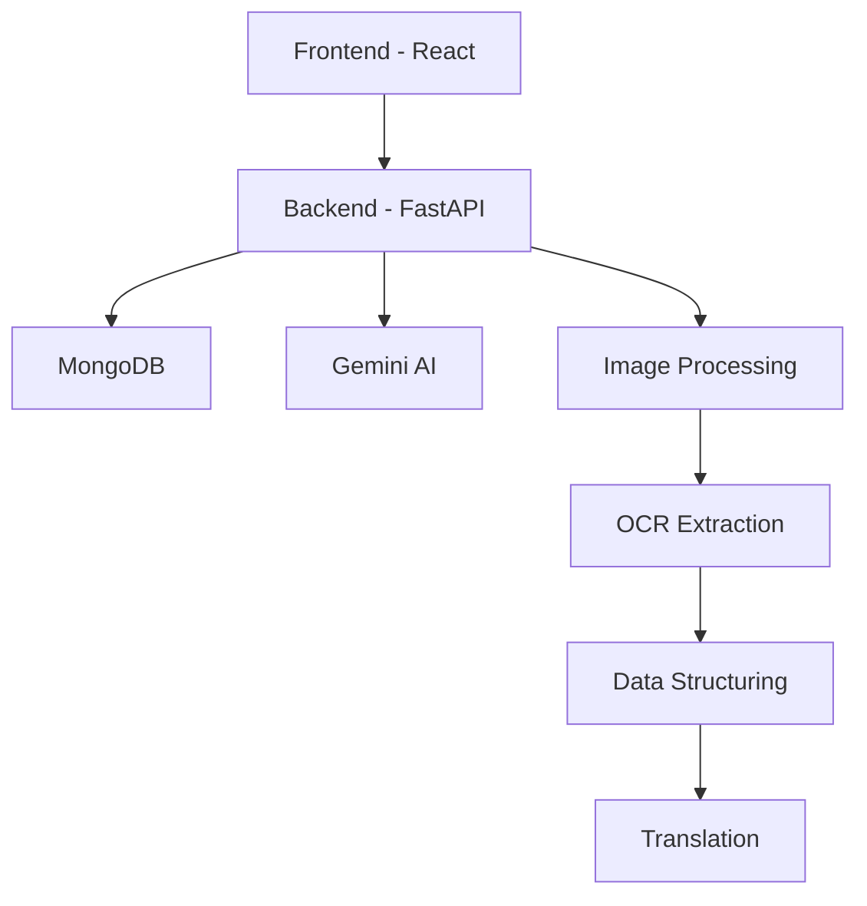
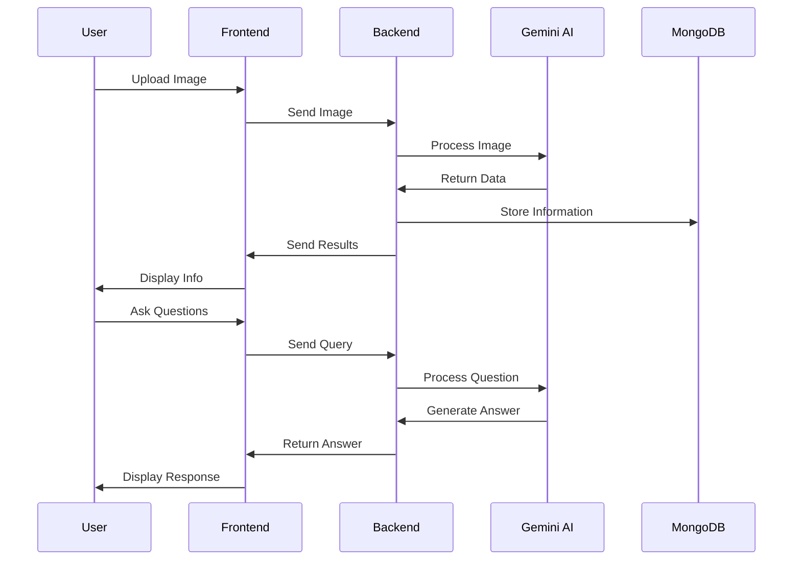

# 🛍️ OCR Product QA - AI-Powered Product Information Assistant

<div align="center">


</div>

## 📝 Overview

OCR Product QA is an intelligent application that helps users understand product information through AI-powered image analysis and natural language processing. The system can extract detailed information from product packaging images and answer questions about products in a conversational manner.

## ✨ Features

- 📸 **Image Analysis**: Extract detailed information from product packaging images
- 🤖 **AI Chatbot**: Interactive Q&A about products using Google's Gemini AI
- 🌐 **Multi-language Support**: Extract and translate information in multiple languages
- 📊 **Structured Data**: Get organized information about:
  - Ingredients and amounts
  - Product name and brand
  - Manufacturing and expiry dates
  - Usage and storage instructions
  - Nutritional information
  - Country of origin
  - Manufacturer details

## 🏗️ Architecture



## 🚀 Tech Stack

### Frontend
- React 19.1.0
- TypeScript
- Material-UI
- Vite

### Backend
- FastAPI
- Python 3.8+
- MongoDB
- Google Gemini AI
- Pydantic

## 🛠️ Installation

### Prerequisites
- Python 3.8 or higher
- Node.js 18 or higher
- MongoDB
- Google Gemini API key

### Backend Setup
1. Clone the repository
2. Navigate to backend directory:
   ```bash
   cd backend
   ```
3. Create virtual environment:
   ```bash
   python -m venv venv
   source venv/bin/activate  # On Windows: venv\Scripts\activate
   ```
4. Install dependencies:
   ```bash
   pip install -r requirements.txt
   ```
5. Create `.env` file:
   ```
   MONGODB_URL=mongodb://localhost:27017
   DATABASE_NAME=chatbot_db
   GEMINI_API_KEY=your_gemini_api_key_here
   ```
6. Start the server:
   ```bash
   uvicorn main:app --reload
   ```

### Frontend Setup
1. Navigate to frontend directory:
   ```bash
   cd frontend
   ```
2. Install dependencies:
   ```bash
   npm install
   ```
3. Start development server:
   ```bash
   npm run dev
   ```

## 📱 Usage

1. **Upload Product Image**
   - Click "New Chat"
   - Upload a clear image of product packaging
   - Select preferred language

2. **Review Information**
   - System extracts and displays product information
   - Review and verify extracted data

3. **Ask Questions**
   - Chat with AI about the product
   - Get detailed answers about ingredients, usage, etc.

## 🔄 Workflow



## 📚 API Documentation

The API documentation is available at `http://localhost:8000/docs` when running the backend server.

### Main Endpoints
- `POST /api/chat` - Create new chat
- `GET /api/chats` - Get all chats
- `POST /api/extractor/extract` - Extract information from image
- `POST /api/extractor/translate` - Translate extracted information
- `POST /api/messages/send` - Send message to AI

## 🤝 Contributing

1. Fork the repository
2. Create your feature branch (`git checkout -b feature/AmazingFeature`)
3. Commit your changes (`git commit -m 'Add some AmazingFeature'`)
4. Push to the branch (`git push origin feature/AmazingFeature`)
5. Open a Pull Request

## 📄 License

This project is licensed under the MIT License - see the [LICENSE](LICENSE) file for details.

## 👥 Authors

- Your Name - Initial work

## 🙏 Acknowledgments

- Google Gemini AI for providing the AI capabilities
- FastAPI for the robust backend framework
- React team for the amazing frontend library
- MongoDB for the database solution 